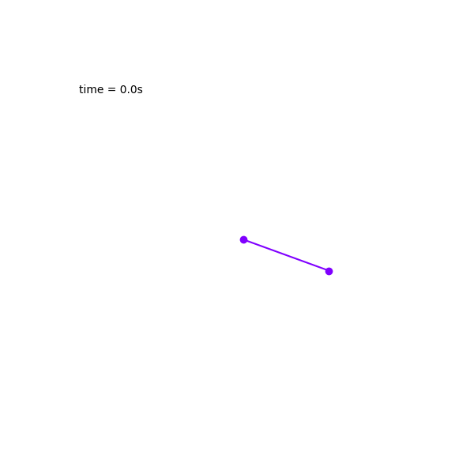

# Pendulum Simulations

This is a mini project that produces simulations of simple or double pendulums with Python. It produces animations of custom systems with one or more classical pendulums and includes graphs of angular displacements and phase space (for double pendulums only).


Requirements:
- matplotlib
- numpy

## Instructions
To simulate a simple pendulum system:

```python
test_pendulum = Pendulum(length=1.0, mass=2.0, theta=120, omega=0) 
test_system = system([test_pendulum]) # initialize a list of pendulum objects in a system
animate_pendulum(test_system) # animate the system
```


Double Pendulum with phase portrait:

```python
pendulum1 = Pendulum(1.0,2.0,70,0)
pendulum2 = Pendulum(1.0,2.0,120,0)
pendulums = [Double_Pendulum(pendulum1,pendulum2)]
test_system = system(pendulums)
animate_pend_graph(test_system, graph='phase space')
```


10 double pendulums with 0.1 difference in angular displacement:

```python
pendulum1 = Pendulum(1.0,2.0,70,0)
pendulums = [Double_Pendulum(pendulum1, Pendulum(1.0, 2.0 + 0.1*i, 120, 0)) for i in range(10)]
test_system = system(pendulums)
animate_pendulum(test_system)
```

